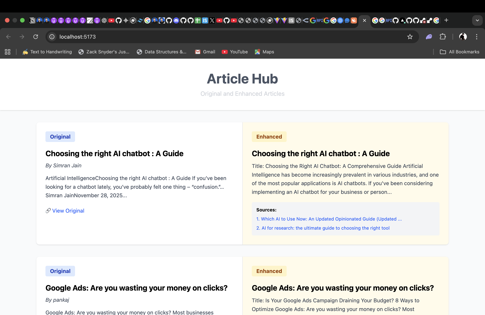
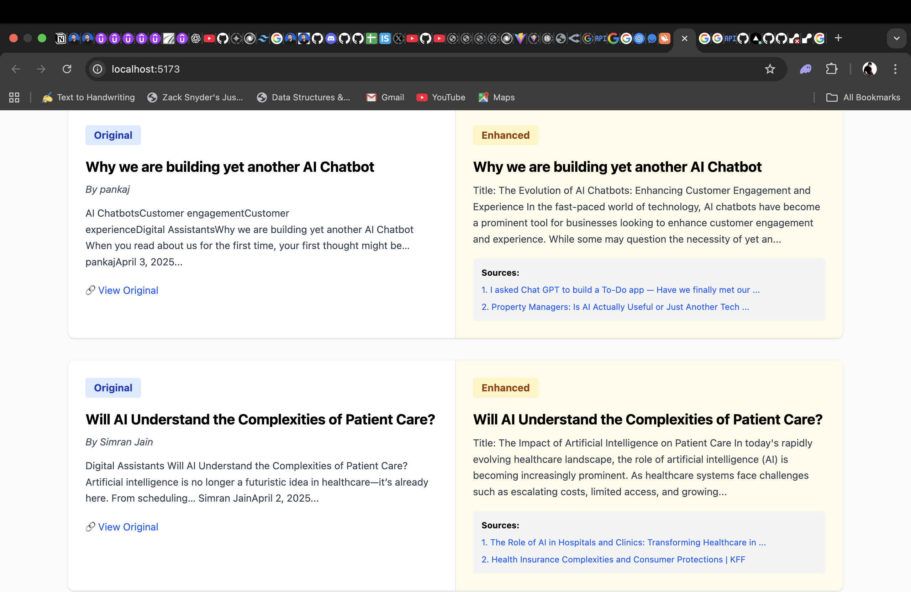
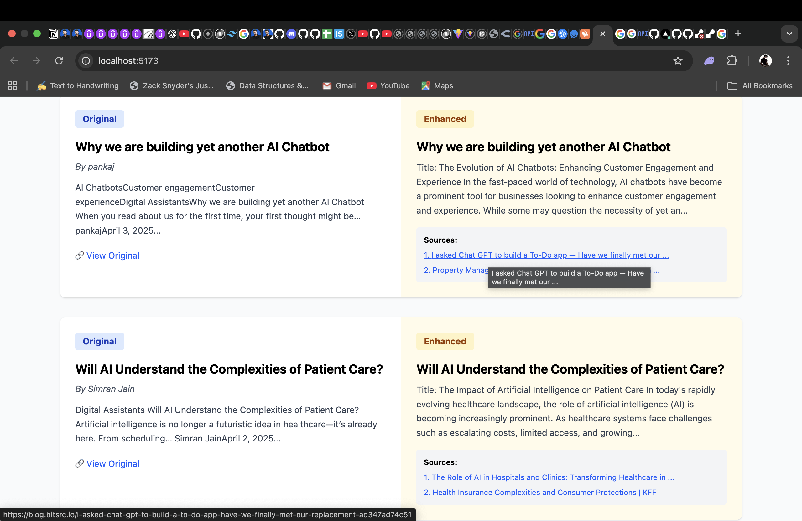
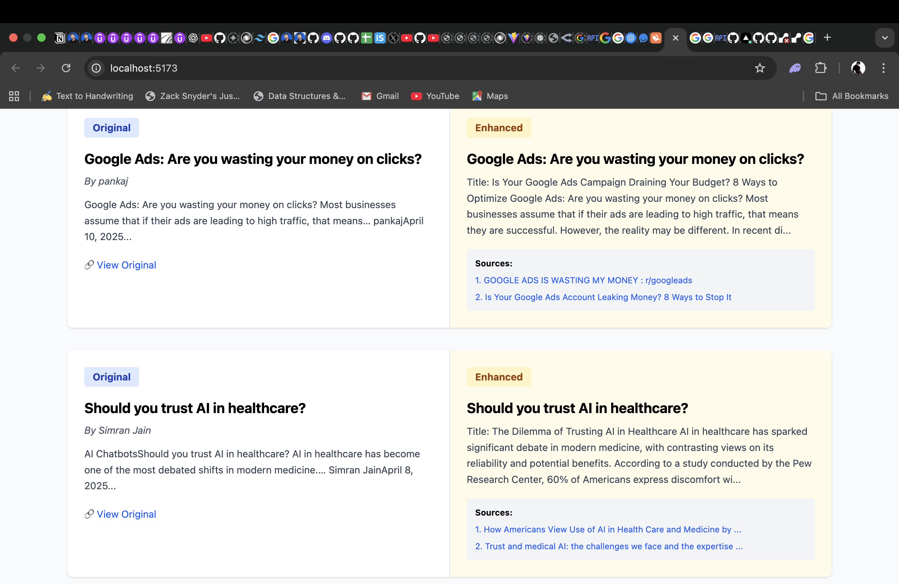

# Article Hub - AI Enhanced Article Platform

A full-stack application that fetches articles, enhances them using AI (OpenRouter/GPT-based models), and displays both original and enhanced versions with source citations.

## 📸 Screenshots

### Article Hub - Home Page
Shows the main interface with side-by-side comparison of original and enhanced articles:


### Original vs Enhanced Articles
Displays multiple articles with original content on the left and AI-enhanced versions with sources on the right:


### Enhanced Content with Sources
Shows enhanced article content with real source citations:


### More Articles Example
Additional examples of article enhancement:


## 🏗️ Architecture Overview

```
┌─────────────────────────────────────────────────────────────────┐
│                     Frontend (React + Vite)                      │
│         http://localhost:5173                                    │
│  - Display original and enhanced articles side-by-side           │
│  - Fetch articles from Laravel API                               │
│  - Show source citations for enhanced content                    │
└────────────────────────────┬────────────────────────────────────┘
                             │
                    HTTP API (REST)
                             │
┌────────────────────────────▼────────────────────────────────────┐
│                  Backend (Laravel 11)                            │
│         http://localhost:8000                                    │
│  - Article CRUD operations                                       │
│  - RESTful API endpoints (/api/articles)                         │
│  - Database: SQLite (default) or MySQL/PostgreSQL                │
└────────────────────────────┬────────────────────────────────────┘
                             │
                    Database (Eloquent ORM)
                             │
┌────────────────────────────▼────────────────────────────────────┐
│              Database (SQLite/MySQL/PostgreSQL)                  │
│  - articles table                                                │
│    - id, title, content, author, url                             │
│    - is_updated, original_article_id, source_urls                │
└─────────────────────────────────────────────────────────────────┘

┌─────────────────────────────────────────────────────────────────┐
│             LLM Enhancer Service (Node.js)                       │
│  - Polls Laravel API for new articles   
   - Fetches source citations from web                      │
│  - Sends articles to OpenRouter API for enhancement              │
   - Stores enhanced articles back to database                     │
                 │
└─────────────────────────────────────────────────────────────────┘
```

## 📋 Data Flow

1. **Article Creation**: Articles are created via the Laravel API (manual or automated)
2. **Enhancement Process**:
   - LLM Enhancer service polls for new articles
   - Fetches real source URLs using web scraping
   - Sends article content to OpenRouter API
   - Receives enhanced version with AI improvements
   - Stores enhanced article with `is_updated=true` and original article ID reference
3. **Display**: Frontend retrieves all articles and displays originals alongside enhanced versions

## 🚀 Local Setup Instructions

### Prerequisites
- Node.js (v18+)
- PHP (v8.2+)
- Composer
- SQLite or MySQL/PostgreSQL
- OpenRouter API Key (for article enhancement)

### Backend Setup (Laravel)

```bash
# Navigate to backend directory
cd backend

# Install PHP dependencies
composer install

# Create .env file
cp .env.example .env

# Generate application key
php artisan key:generate

# Run database migrations
php artisan migrate

# (Optional) Seed database with sample data
php artisan db:seed

# Start Laravel development server
php artisan serve
# Server runs on http://127.0.0.1:8000
```

### Frontend Setup (React)

```bash
# Navigate to frontend directory
cd frontend

# Install dependencies
npm install

# Start development server
npm run dev
# Frontend runs on http://localhost:5173
```

### LLM Enhancer Setup (Node.js)

```bash
# Navigate to llm-enhancer directory
cd llm-enhancer

# Install dependencies
npm install

# Create .env file
cat > .env << EOF
OPENROUTER_API_KEY=your_openrouter_api_key_here
LARAVEL_API_URL=http://127.0.0.1:8000/api
EOF

# Start the enhancement service
node enhanced-article.js
# Service will automatically enhance new articles
```

## 📝 Environment Variables

### Backend (.env)
```env
APP_NAME=ArticleHub
APP_ENV=local
APP_DEBUG=true
APP_URL=http://localhost:8000

DB_CONNECTION=sqlite
# or use MySQL:
# DB_CONNECTION=mysql
# DB_HOST=127.0.0.1
# DB_PORT=3306
# DB_DATABASE=article_hub
# DB_USERNAME=root
# DB_PASSWORD=
```

### LLM Enhancer (.env)
```env
OPENROUTER_API_KEY=sk-or-v1-your-key-here
LARAVEL_API_URL=http://127.0.0.1:8000/api
ENHANCEMENT_INTERVAL=300000  # Check for new articles every 5 minutes
```

## 🔧 API Endpoints

### Get All Articles
```bash
GET http://127.0.0.1:8000/api/articles
```

### Get Single Article
```bash
GET http://127.0.0.1:8000/api/articles/{id}
```

### Create Article
```bash
POST http://127.0.0.1:8000/api/articles
Content-Type: application/json

{
  "title": "Article Title",
  "content": "Article content here...",
  "author": "Author Name",
  "url": "https://original-source.com/article"
}
```

### Update Article
```bash
PUT http://127.0.0.1:8000/api/articles/{id}
Content-Type: application/json

{
  "title": "Updated Title",
  "content": "Updated content...",
  "is_updated": true,
  "source_urls": [{"title": "Source 1", "url": "https://..."}]
}
```

### Delete Article
```bash
DELETE http://127.0.0.1:8000/api/articles/{id}
```

## 📂 Project Structure

```
beyond-chats-assignment/
├── backend/                    # Laravel API
│   ├── app/
│   │   ├── Http/Controllers/   # API controllers
│   │   ├── Models/             # Eloquent models
│   │   └── Providers/
│   ├── database/
│   │   ├── migrations/         # Database schema
│   │   └── factories/          # Model factories
│   ├── routes/
│   │   └── api.php             # API routes
│   ├── .env.example
│   └── composer.json
├── frontend/                   # React + Vite
│   ├── src/
│   │   ├── App.jsx             # Main app component
│   │   └── main.jsx            # Entry point
│   ├── package.json
│   └── vite.config.js
├── llm-enhancer/              # Article enhancement service
│   ├── enhanced-article.js    # Main enhancement logic
│   ├── .env.example
│   └── package.json
└── README.md                  # This file
```

## 🎯 Features

- ✅ **Original Articles**: Store and display original articles
- ✅ **AI Enhancement**: Automatically enhance articles using OpenRouter API
- ✅ **Source Citations**: Include real source URLs for enhanced content
- ✅ **Side-by-Side Comparison**: View original and enhanced versions simultaneously
- ✅ **RESTful API**: Full CRUD operations on articles
- ✅ **Responsive Design**: Works on desktop and mobile devices
- ✅ **Real-time Updates**: Enhanced articles appear automatically

## 🔐 Security Notes

- API keys should never be committed to version control
- Always use `.env` files for sensitive data
- Enable CORS appropriately for production
- Validate all user inputs on the backend

## 🚨 Troubleshooting

### Laravel API not connecting
- Ensure Laravel server is running: `php artisan serve`
- Check if port 8000 is available
- Verify API URL in frontend: `http://127.0.0.1:8000/api/articles`

### Frontend not loading
- Ensure Node.js dependencies are installed: `npm install`
- Check if Vite dev server is running: `npm run dev`
- Clear browser cache if styles don't appear

### Articles not being enhanced
- Verify OpenRouter API key is valid
- Check LLM Enhancer service logs
- Ensure Laravel API is accessible to the service
- Check OpenRouter API rate limits

## 📦 Tech Stack

- **Frontend**: React 18, Vite, Axios, Tailwind CSS
- **Backend**: Laravel 11, Eloquent ORM, PHP 8.2
- **Database**: SQLite (default), MySQL/PostgreSQL compatible
- **AI Service**: OpenRouter API, Cheerio (web scraping)
- **Enhancement**: Node.js with Axios

## 📄 License

This project is open source and available under the MIT License.

## 👥 Contributors

- [Jayed Akhtar] - Full-stack development

## 🤝 Support

For issues or questions, please create an issue in the repository.
